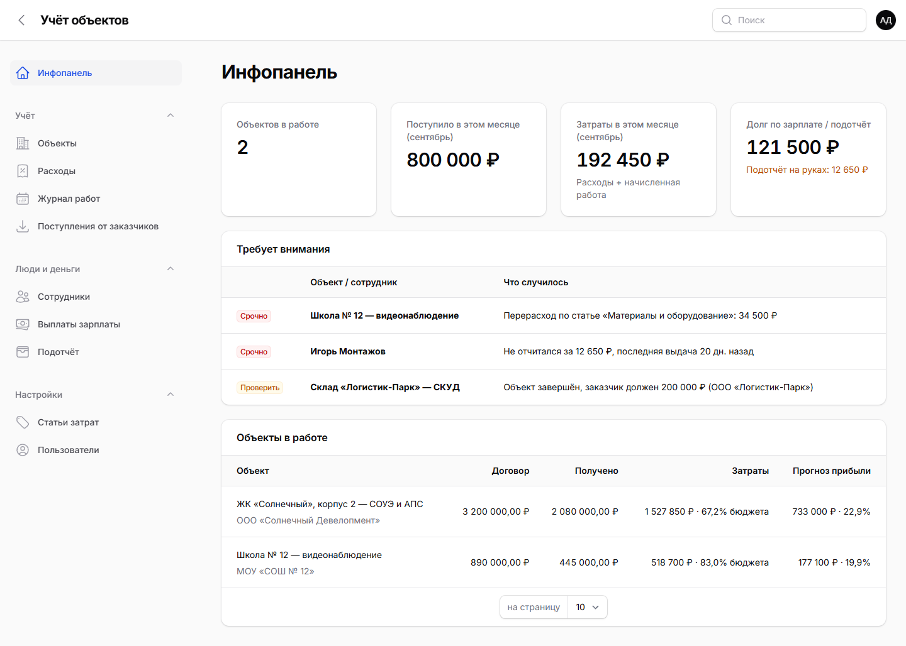
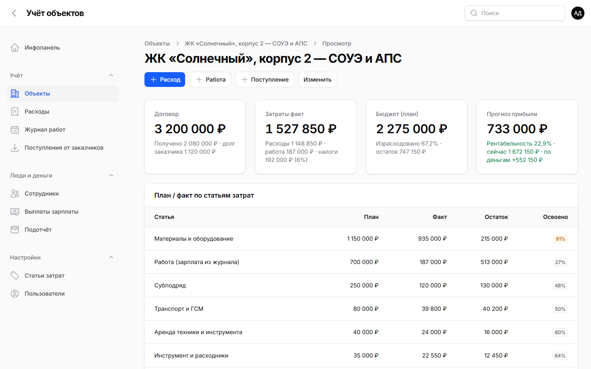
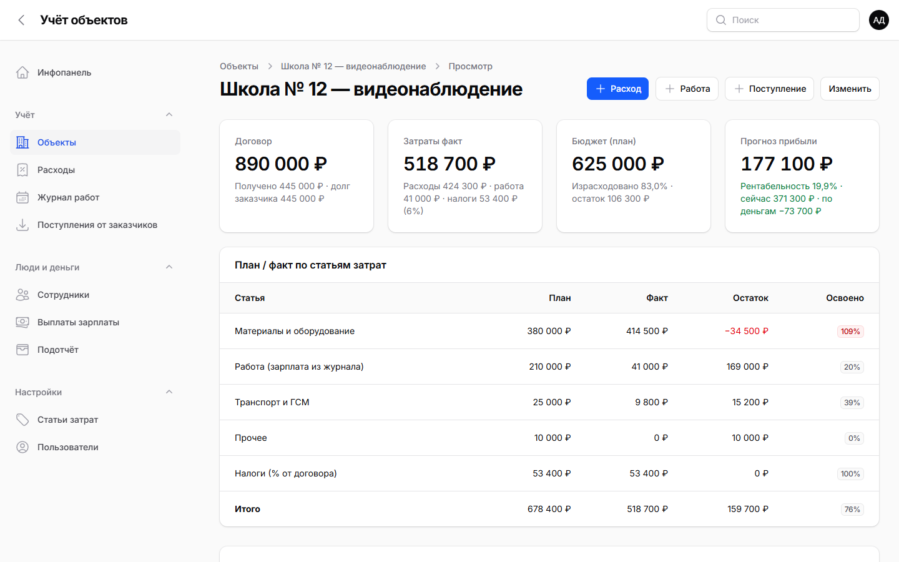
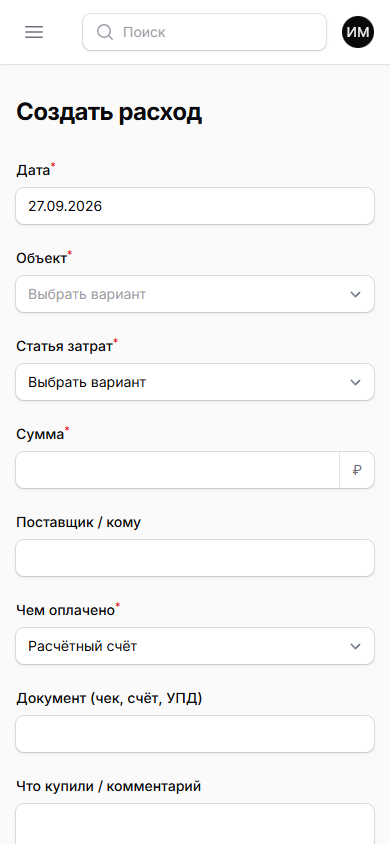

# Учёт объектов

**Учёт затрат, зарплат и прибыли по объектам для монтажных организаций.**
Сколько потрачено на каждый объект, сколько осталось по бюджету, кому и сколько должны, что заказчик уже заплатил и сколько останется в итоге.

[](https://github.com/johndoecesko/uchet-obektov/actions/workflows/tests.yml)


> *English:* a self-hosted cost-per-project accounting tool for small installation / construction contractors (fire alarm, CCTV, access control, electrical). Budgets by expense category, expenses with receipt photos, crew work log and wages, cash advances, customer payments, tax as % of contract and forecast profit. Laravel 12 + Filament 4, installable as a PWA. Russian UI.

<!-- screenshots:start -->


| Карточка объекта: план/факт и прогноз прибыли | Перерасход по статье сразу виден |
|---|---|
|  |  |

<p align="center">
  <br>
  <sub>С телефона (PWA): прораб вносит расход прямо на объекте</sub>
</p>
<!-- screenshots:end -->

## Для кого

Небольшие монтажные и строительные компании: пожарная сигнализация и оповещение, видеонаблюдение, СКУД, слаботочка, электромонтаж. Вместо таблиц в Excel и чеков в мессенджерах у вас одно место, где видна экономика каждого объекта.

## Что умеет

- **Объекты и договоры.** Заказчик по ИНН подтягивается из DaData, адрес ищется с подсказками. Бюджет задаётся по статьям затрат.
- **Расходы.** Материалы, субподряд, транспорт, аренда и прочее. К расходу прикладывается фото чека или УПД. Можно указать источник оплаты: счёт, карта, касса или подотчёт сотрудника.
- **Журнал работ.** Кто, где и сколько дней работал. Зарплата начисляется автоматически (дни × ставка) и сразу ложится в затраты объекта.
- **Выплаты и подотчёт.** Долг по зарплате и остаток подотчёта по каждому сотруднику.
- **Поступления от заказчика.** Аванс, этапы, окончательный расчёт и долг заказчика.
- **Налоги.** Процент от суммы договора (УСН 6%, НДС и т.п.) считается как отдельная статья затрат.
- **План/факт и прогноз прибыли.** Освоение бюджета по каждой статье и итоговый прогноз по объекту.
- **«Требует внимания».** На главной собраны проблемы:
  - перерасход по статье;
  - объект, который уходит в минус;
  - низкая рентабельность;
  - незакрытый подотчёт старше 14 дней;
  - долг заказчика по завершённому объекту.
- **Роли.**
  - *Администратор* — всё.
  - *Менеджер / бухгалтер* — вся финансовая часть, без настроек и пользователей.
  - *Прораб / монтажник* видит объекты и вносит свои расходы и работы. Чужие записи и деньги компании ему не видны.
- **Как приложение на телефоне (PWA).** Устанавливается на Android и iPhone с главного экрана. В меню ярлыка есть «Новый расход» и «Запись в журнал работ», так что чек можно внести прямо на объекте.

## Как считаются деньги по объекту

| Показатель | Формула |
|---|---|
| Затраты факт | расходы + зарплата из журнала работ + налог (% от договора) |
| Маржа по договору | сумма договора − затраты факт |
| Денежный результат | получено от заказчика − затраты факт |
| Долг заказчика | сумма договора − получено |
| **Прогноз прибыли** | сумма договора − Σ по статьям *max(план, факт)* |

Логика прогноза простая: пока статья укладывается в бюджет, считаем, что она израсходуется полностью. Если по статье уже перерасход, в прогноз идёт факт. Поэтому прогноз не бывает оптимистичнее реальности.

## Стек

- PHP 8.2+ (рекомендуется 8.3), [Laravel 12](https://laravel.com), [Filament 4](https://filamentphp.com).
- База: MySQL / MariaDB в работе, SQLite для разработки и тестов.
- Без Node.js и сборки фронтенда: достаточно загрузить файлы на обычный виртуальный хостинг.

## Быстрый старт (локально)

```bash
git clone https://github.com/johndoecesko/uchet-obektov.git uchet && cd uchet
composer install
cp .env.example .env
php artisan key:generate
php artisan migrate --seed                   # справочник статей затрат
php artisan db:seed --class=DemoSeeder       # демо-данные (необязательно)
php artisan serve
```

Откройте http://localhost:8000. Все демо-пользователи входят с паролем `demo12345`:

| Email | Роль |
|---|---|
| admin@demo.local | Администратор |
| manager@demo.local | Менеджер / бухгалтер |
| foreman@demo.local | Прораб / монтажник |

Своего администратора можно создать командой `php artisan app:admin you@example.ru "Имя"`. Пароль вводится скрыто.

## Установка на сервер

Подойдёт любой хостинг с PHP 8.2+, MySQL и SSH (проверено на виртуальном хостинге с ISPmanager).

1. Создайте базу MySQL и пользователя в панели хостинга.
2. Загрузите проект в папку сайта. Корнем сайта (document root) должна быть папка `public/`.
3. По SSH в папке проекта выполните:
   ```bash
   bash deploy/setup.sh                                   # PHP по умолчанию
   PHP=/opt/php/8.3/bin/php bash deploy/setup.sh          # если PHP 8.3 лежит отдельно
   ```
   Скрипт установит зависимости и запишет настройки в `.env`. Пароль к базе при этом не попадает в историю команд. Потом скрипт создаст таблицы и справочник и попросит завести администратора.
4. Необязательно: подключите подсказки DaData (см. ниже).

Как обновить сайт: загрузите новые файлы, затем выполните `php artisan migrate --force && php artisan optimize`.

> Не запускайте `php artisan test` в рабочей папке. Если конфиг закэширован под MySQL, тесты очистят боевую базу. Для тестов используйте отдельную копию или CI.

## Подсказки DaData (необязательно)

С ключом [DaData](https://dadata.ru/api/suggest/) карточка объекта заполняется быстрее:

- **Заказчик.** Начните вводить ИНН, ОГРН или название. Выберите организацию из списка, и ИНН, КПП, ОГРН и юридический адрес подставятся сами. Ликвидированные организации помечены в списке.
- **Адрес объекта.** Адрес подсказывается по мере ввода.

Без ключа всё работает так же, просто эти поля заполняются вручную.

**Как подключить**

1. Зарегистрируйтесь на [dadata.ru](https://dadata.ru/). Для подсказок хватает бесплатного тарифа.
2. В личном кабинете скопируйте **API-ключ**. Секретный ключ не нужен.
3. Впишите ключ в `.env` на сервере:
   ```dotenv
   DADATA_TOKEN=ваш_api_ключ
   ```
4. Выполните `php artisan optimize`, чтобы обновить закэшированный конфиг.

**Как это устроено**

- Приложение обращается к API подсказок DaData со своего сервера (`app/Support/DaData.php`). Ключ хранится только в `.env` и в браузер не попадает.
- В DaData уходит только то, что пользователь набрал в поле поиска: ИНН, название или часть адреса.
- Если DaData не отвечает (таймаут 5 секунд) или вернула ошибку, подсказок просто не будет, а в лог пишется предупреждение. Форма продолжает работать.
- Реквизиты выбранной организации держатся в кэше 2 часа, пока заполняется форма.
- `.env` не входит в репозиторий (он в `.gitignore`). Не коммитьте свой ключ: в `.env.example` поле `DADATA_TOKEN` оставлено пустым.

## Тесты

```bash
php artisan test
```

Тесты покрывают расчёты по объекту (план/факт, налог, прогноз), балансы сотрудников, права ролей, блок «Требует внимания», подсказки DaData (с подменой HTTP), демо-данные и PWA. На каждый push тесты запускаются в GitHub Actions.

## Разработка на заказ

Проект сделан в **Базион** как рабочий инструмент для монтажной организации. Можем адаптировать его под ваш процесс:

- сметы и закупки;
- склад материалов;
- интеграция с 1С и банком;
- отчёты для собственника;
- отдельные роли.

Делаем и другие проекты:

- **Боты для мессенджера MAX** под любую задачу: приём заявок и чеков, уведомления, запись клиентов, опросы, внутренние боты для сотрудников. Боты для Telegram тоже делаем.
- **Интеграция MAX с CRM**: Битрикс24, amoCRM и другие. Сообщения и заявки из MAX попадают в CRM, а уведомления из CRM приходят в MAX.
- **Интеграции между сервисами**: CRM, 1С, банк, сайт, мессенджеры, а также это приложение учёта.

Связаться: Telegram @grdpr, 3000.freedom@gmail.com

## Лицензия

[MIT](LICENSE): можно использовать, менять и продавать, в том числе в коммерческих проектах. Нужно лишь сохранить уведомление об авторстве.
